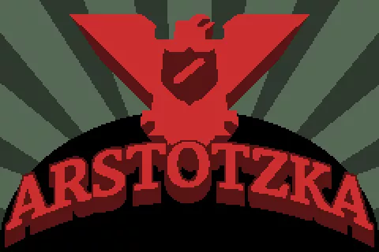

# Arstotzka-Generator

A simple video generator of a custom ending of the famous Papers Please game. Works on a Windows environment.
It uses the images from the **ending n°10** of the game.

## [Example](example.mp4)

## How to use?

- Clone the repository (git clone https://github.com/Valenwe/Arstotzka-Generator) and install Python3
- Install the requirements necessary with `pip install -r requirements.txt`.
- [Download](https://github.com/BtbN/FFmpeg-Builds/releases) the **ffmpeg.exe** binary either in your PATH environment, or simply in the root directory of the project.
- Change the text file `report.txt` content, with **each line** corresponding to an image. There is a total of **4 maximum images**, so **4 lines** in the text file.
- Run the Python script from the root directory through `python main.py`.
- Enjoy! (the video will be named **jail.mp4**)

N.B: There will always be a last image with the **Arstotzka** propaganda and the famous three words **Glory to Arstotzka**.

## Can I custom the images?

- Of course you can! To do that, you have to keep the same syntax (starting from *0.png* to *X.png*) in `/imgs`, and the same resolution aswell, such as **480 x 320** (if the resolution is different, the program will stretch the image).
- It is also possible to change the background music, which correspond to the file `sounds/Death.wav`.