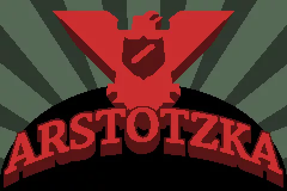

# Arstotzka-Generator

A simple video generator of a custom ending of the famous Papers Please game.
It uses the images from the **ending n°10** of the game.

## [Example](example.mp4)

## How to use?

- Install the requirements necessary with `pip install -r requirements.txt`
- Change the text file `report.txt` content, with **each line** corresponding to an image. There is a total of **4 maximum images**, so **4 lines** in the text file.
- Run the Python script through `main.py`
- Enjoy!

N.B: There will always be a last image with the **Arstotzka** propaganda and the famous three words **Glory to Arstotzka**.

## Can I custom the images?

Of course you can! To do that, you have to keep the same filenames in `/sounds`, and the same resolution aswell, such as **480 x 320**.
It is also possible to change the background music, which correspond to the file `sounds/Death.wav`.